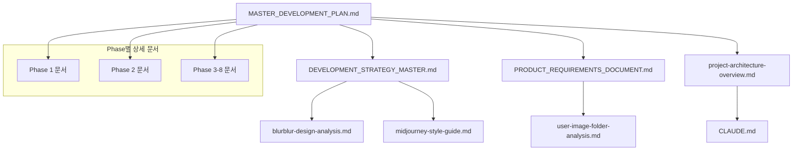

# 🚀 AI 모델 갤러리 마스터 개발 계획

> **중요**: 이 문서는 **모든 개발 세션의 진입점**입니다. 새로운 채팅을 시작할 때 반드시 이 문서를 먼저 읽어 현재 진행 상황과 다음 작업을 파악하세요.

---

## 📋 **새로운 채팅 세션 시작 시 필수 체크리스트**

### 🔍 **1단계: 컨텍스트 로딩**
```bash
# 다음 명령어로 프로젝트 컨텍스트 로딩
--c7 프로젝트 문서 읽기:
1. DEVELOPMENT_STRATEGY_MASTER.md (핵심 전략)
2. PRODUCT_REQUIREMENTS_DOCUMENT.md (상세 요구사항)  
3. MASTER_DEVELOPMENT_PLAN.md (이 문서)
4. user-image-folder-analysis.md (실제 데이터 분석)
5. project-architecture-overview.md (기술 아키텍처)
```

### 🎯 **2단계: 현재 상태 확인**
- **현재 Phase**: [아래 진행 현황에서 확인]
- **활성 작업**: [TODO 리스트에서 확인]
- **블로커 여부**: [문제사항 섹션 확인]

### ⚡ **3단계: 작업 시작**
- **우선순위**: 현재 Phase의 pending → in_progress 작업 진행
- **의존성 확인**: 다른 Phase의 완료 상태 검증
- **기술스택 검증**: 2025 최신 버전 사용 (Next.js 15.4.0, React 19, TypeScript 5.9.2)

---

## 🗺️ **전체 개발 로드맵 (8 Phases)**

### **Phase 1**: 개발 환경 세팅 및 기초 구조 구축 (1-2주)
**목표**: 프로젝트 기반 인프라 구축
**상태**: ⏳ 준비 중

#### 세부 작업:
1. **프로젝트 초기화**
   - Next.js 15.4.0-canary 프로젝트 생성
   - TypeScript 5.9.2 설정
   - ESLint, Prettier, Git hooks 설정
   
2. **기술스택 설치 및 설정**
   - Tailwind CSS v4 설정 (새로운 @import 구문)
   - Prisma ORM v6 설정 및 스키마 초기화
   - NextAuth.js v5 설정
   - 개발 도구 설정 (VS Code 설정, 디버깅 환경)

3. **기본 프로젝트 구조 생성**
   - 디렉토리 구조 생성 (project-architecture-overview.md 참조)
   - 기본 페이지 라우팅 설정
   - 환경 변수 설정 (.env 파일들)
   - 개발/프로덕션 빌드 스크립트 설정

**완료 조건**:
- ✅ 로컬에서 Next.js 개발 서버 실행 가능
- ✅ TypeScript 컴파일 에러 없음
- ✅ Prisma 마이그레이션 정상 실행
- ✅ Git repository 초기화 완료

---

### **Phase 2**: 핵심 UI 컴포넌트 개발 (BlurBlur.ai 클론) (2-3주)  
**목표**: BlurBlur.ai 디자인 시스템 완벽 복제
**상태**: ⏳ 대기 중
**의존성**: Phase 1 완료 필요

#### 세부 작업:
1. **디자인 시스템 구축**
   - BlurBlur.ai 컬러 팔레트 구현 (화이트 테마)
   - 타이포그래피 시스템 구축
   - 일관된 간격 및 크기 시스템
   - 반응형 브레이크포인트 정의

2. **기본 레이아웃 컴포넌트**
   - Header/Navigation 컴포넌트 (blurblur-design-analysis.md 참조)
   - Footer 컴포넌트
   - 메인 레이아웃 래퍼
   - 로딩 상태 컴포넌트

3. **네비게이션 및 메뉴**
   - 상단 네비게이션 메뉴
   - 카테고리 필터 메뉴
   - 모바일 햄버거 메뉴
   - 검색바 컴포넌트

**완료 조건**:
- ✅ BlurBlur.ai와 95% 시각적 일치도
- ✅ 반응형 디자인 완벽 동작
- ✅ 모든 기본 컴포넌트 Storybook 등록
- ✅ 접근성 기준 충족 (WCAG 2.1 AA)

---

### **Phase 3**: Masonry 갤러리 시스템 구현 (2-3주)
**목표**: Midjourney 스타일 완벽한 Masonry 레이아웃
**상태**: ⏳ 대기 중  
**의존성**: Phase 2 완료 필요

#### 세부 작업:
1. **Masonry 레이아웃 엔진**
   - react-responsive-masonry 통합
   - 다양한 이미지 크기 지원 (midjourney-style-guide.md 참조)
   - 반응형 컬럼 조정 (모바일 2열 → 데스크톱 5-6열)
   - 자연스러운 이미지 배치 알고리즘

2. **모델 카드 컴포넌트**
   - 이미지 표시 및 lazy loading
   - 메타데이터 오버레이
   - 호버 효과 및 상호작용
   - 접근성 키보드 네비게이션

3. **무한 스크롤 및 성능 최적화**
   - Intersection Observer 기반 무한 스크롤
   - 이미지 지연 로딩 최적화
   - 메모리 관리 (가상화 고려)
   - 스크롤 복원 기능

**완료 조건**:
- ✅ Midjourney와 동일한 레이아웃 동작
- ✅ 60fps 스무스 스크롤링
- ✅ 모바일에서 완벽한 터치 네비게이션
- ✅ 1000+ 이미지 로딩 시 성능 안정성

---

### **Phase 4**: 백엔드 API 및 데이터베이스 구축 (2-3주)
**목표**: 데이터 관리 시스템 및 API 구축
**상태**: ⏳ 대기 중
**의존성**: Phase 1 완료 필요 (Prisma 설정)

#### 세부 작업:
1. **데이터베이스 스키마 구현**
   - Prisma ORM v6 스키마 완성 (Civitai 패턴 참조)
   - 모델, 카테고리, 태그 관계 정의
   - 파일 메타데이터 및 변형 관계 설정
   - 마이그레이션 스크립트 작성

2. **핵심 API 엔드포인트**
   - 모델 CRUD API (`/api/models/*`)
   - 카테고리 및 필터 API (`/api/categories/*`)
   - 검색 API (`/api/search`)
   - 메타데이터 API (`/api/metadata/*`)

3. **API 최적화**
   - 데이터베이스 쿼리 최적화
   - 페이지네이션 및 정렬
   - 캐싱 전략 (Redis 고려)
   - API 응답 시간 <500ms 목표

**완료 조건**:
- ✅ 모든 API 엔드포인트 정상 동작
- ✅ API 응답 시간 <500ms
- ✅ 데이터베이스 인덱싱 최적화 완료
- ✅ API 문서화 (Swagger/OpenAPI)

---

### **Phase 5**: 관리자 업로드 시스템 구현 (3-4주)
**목표**: 대용량 파일 배치 업로드 시스템
**상태**: ⏳ 대기 중
**의존성**: Phase 4 완료 필요

#### 세부 작업:
1. **파일명 자동 파싱 시스템**
   - 실제 파일 패턴 분석 (user-image-folder-analysis.md 기반)
   - AI 생성 도구별 패턴 인식 (u3934589919, imgvnf, generation 등)
   - 프롬프트 텍스트 자동 추출
   - UUID 및 변형 번호 파싱

2. **배치 업로드 인터페이스**
   - 드래그 앤 드롭 폴더 업로드
   - 진행률 표시 및 에러 처리
   - 600+ 파일 동시 처리 지원
   - 백그라운드 처리 큐 시스템

3. **관리자 검토 시스템**  
   - 업로드된 파일 일괄 검토 인터페이스
   - 메타데이터 수정 및 카테고리 분류
   - 일괄 승인/거절 기능
   - 품질 검증 도구

**완료 조건**:
- ✅ 601개 실제 파일 성공적 업로드
- ✅ 90% 메타데이터 자동 추출 정확도
- ✅ 에러 없는 배치 처리 완료
- ✅ 관리자 워크플로우 검증 완료

---

### **Phase 6**: 파일 처리 및 최적화 파이프라인 (2-3주)
**목표**: 이미지/비디오 최적화 자동화
**상태**: ⏳ 대기 중
**의존성**: Phase 5 완료 필요

#### 세부 작업:
1. **이미지 처리 파이프라인**
   - WebP 자동 변환 (40% 용량 절약 목표)
   - 다중 해상도 썸네일 생성 (150px, 300px, 600px)
   - EXIF 데이터 추출 및 처리
   - 컬러 팔레트 자동 분석

2. **비디오 처리 파이프라인**
   - H.264 표준 인코딩
   - 썸네일 프레임 추출
   - 다중 해상도 변환 (720p, 1080p)
   - 비디오 메타데이터 추출

3. **AWS S3 및 CDN 통합**
   - S3 업로드 자동화
   - CloudFront CDN 설정
   - 이미지 서빙 최적화
   - 비용 최적화 (예상 $0.12/월)

**완료 조건**:
- ✅ 1.47GB → 1.03GB 최적화 달성
- ✅ 모든 이미지 WebP 변환 완료
- ✅ CDN을 통한 <1초 이미지 로딩
- ✅ 비디오 스트리밍 품질 검증

---

### **Phase 7**: 문의 시스템 및 사용자 기능 (2주)
**목표**: BlurBlur.ai 4단계 문의 프로세스 구현
**상태**: ⏳ 대기 중
**의존성**: Phase 3, 4 완료 필요

#### 세부 작업:
1. **4단계 문의 시스템**
   - Step 1: 문의 유형 선택 (라이선스, 커스텀 등)
   - Step 2: 모델 선택 (드롭다운 + 썸네일)
   - Step 3: 상세 요구사항 입력 
   - Step 4: 의뢰자 정보 및 제출

2. **검색 및 필터링**
   - 카테고리 필터 (Asian, Europe, Africa America 등)
   - 산업별 필터 (Fashion, Cosmetics, Leisure/Sports)
   - 태그 기반 검색
   - 고급 검색 옵션

3. **사용자 경험 개선**
   - 즐겨찾기 기능
   - 최근 조회 이력
   - 공유 기능
   - 반응형 모바일 최적화

**완료 조건**:
- ✅ 4단계 문의 프로세스 완벽 동작
- ✅ 문의 전환율 5% 목표 달성
- ✅ 모든 필터링 기능 정확 동작
- ✅ 모바일 사용성 95점 달성

---

### **Phase 8**: 테스팅, 배포 및 최적화 (2-3주)
**목표**: 프로덕션 준비 및 성능 최적화
**상태**: ⏳ 대기 중
**의존성**: 모든 Phase 완료 필요

#### 세부 작업:
1. **성능 최적화**
   - Core Web Vitals 모든 지표 "Good" 달성
   - LCP < 2.5초, FID < 100ms, CLS < 0.1
   - 번들 크기 최적화 (<500KB initial)
   - 데이터베이스 쿼리 최적화

2. **품질 보증**
   - E2E 테스트 (Playwright)
   - 단위 테스트 (Jest + React Testing Library)
   - 접근성 테스트 (WCAG 2.1 AA)
   - 보안 감사 (OWASP Top 10)

3. **배포 및 모니터링**
   - Vercel 프론트엔드 배포
   - Railway 백엔드 배포  
   - AWS 인프라 설정
   - 모니터링 시스템 구축

**완료 조건**:
- ✅ 모든 성능 지표 목표 달성
- ✅ 테스트 커버리지 >80%
- ✅ 프로덕션 배포 성공
- ✅ 모니터링 시스템 정상 동작

---

## 📊 **현재 진행 현황**

### ✅ **완료된 작업**
- [x] 프로젝트 기획 및 문서화
- [x] 기술 스택 2025 최신 버전 선정
- [x] 실제 사용자 데이터 분석 (601개 파일)
- [x] 디자인 시스템 분석 (BlurBlur.ai 화이트 테마 확정)

### 🔄 **현재 진행 중**
- [ ] **Phase 1 준비**: 개발 환경 세팅 계획 수립

### ⏳ **대기 중인 작업**  
- Phase 1 ~ Phase 8 모든 개발 단계

---

## 🚨 **중요 제약사항 및 원칙**

### 🔒 **절대 변경 금지 사항**
```yaml
디자인_아이덴티티: 
  - BlurBlur.ai 화이트 테마 (다크 테마 아님!)
  - 미니멀한 클린 UI
  - 전문적 브랜딩

레이아웃_시스템:
  - Midjourney 스타일 Masonry Grid 필수
  - 다양한 크기 이미지 지원
  - 반응형 컬럼 조정 (2열→5-6열)

기술_제약사항:
  - 관리자만 업로드 가능 (UGC 아님)
  - 실제 데이터 기반 (601개 파일 패턴)
  - 성능 목표 달성 필수
```

### ⚡ **성능 목표**
```yaml
Core_Web_Vitals:
  LCP: "< 2.5초"
  FID: "< 100ms"  
  CLS: "< 0.1"

사용자_경험:
  페이지_로딩: "< 2.5초 (3G)"
  이미지_표시: "< 1초 (viewport)"
  API_응답: "< 500ms"
```

---

## 🔗 **문서 간 연결성 맵**



---

## 📝 **새로운 채팅 세션에서 사용할 명령어**

### 🎯 **기본 컨텍스트 로딩**
```bash
# 1. 마스터 계획 읽기
@MASTER_DEVELOPMENT_PLAN.md

# 2. 현재 단계 확인
현재 Phase는? 어떤 작업이 진행 중인가?

# 3. 다음 작업 시작
Phase [N]의 다음 작업을 시작해 주세요.
```

### 🔧 **개발 작업 시작**
```bash  
# Phase 1 시작
Phase 1 개발 환경 세팅을 시작해 주세요.
필요한 문서들을 읽고 Next.js 15.4.0 프로젝트를 초기화해 주세요.

# Phase 2 시작  
Phase 2 UI 컴포넌트 개발을 시작해 주세요.
BlurBlur.ai 디자인 시스템을 참조하여 Header 컴포넌트를 만들어 주세요.
```

### 📚 **문서 참조**
```bash
# 기술 스택 확인
@DEVELOPMENT_STRATEGY_MASTER.md의 기술 스택 섹션을 확인해 주세요.

# 실제 데이터 분석
@user-image-folder-analysis.md를 읽고 파일명 파싱 로직을 구현해 주세요.

# 디자인 분석  
@blurblur-design-analysis.md를 참조하여 화이트 테마 컴포넌트를 만들어 주세요.
```

---

## 🎯 **다음 세션에서 할 일**

### 📋 **즉시 진행 가능한 작업**
1. **Phase 1 시작**: Next.js 15.4.0 프로젝트 초기화
2. **환경 설정**: TypeScript, Tailwind CSS v4, Prisma v6 설정
3. **기본 구조**: 디렉토리 구조 및 라우팅 설정

### ⚠️ **주의사항**
- 반드시 2025 최신 기술 스택 버전 사용
- BlurBlur.ai 화이트 테마 확인 (다크 테마 아님!)
- 실제 데이터 패턴 (601개 파일) 기반 구현
- 성능 목표 달성을 위한 최적화 고려

---

**🚀 이 계획서를 바탕으로 체계적인 개발을 시작하세요!**