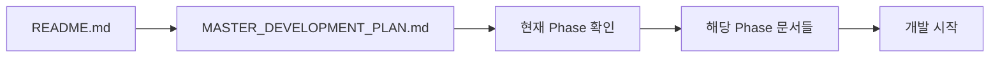

# 🎨 AI 모델 갤러리 프로젝트

> **BlurBlur.ai 디자인 + Midjourney 레이아웃 + 실제 데이터 기반** AI 모델 쇼케이스 플랫폼

---

## 🚀 **새로운 세션 시작 가이드**

### 📋 **필수: 첫 번째로 읽어야 할 문서**
```bash
1. 📘 MASTER_DEVELOPMENT_PLAN.md    # 👈 모든 세션의 진입점!
2. 📗 DEVELOPMENT_STRATEGY_MASTER.md # 핵심 전략 및 원칙
3. 📙 PRODUCT_REQUIREMENTS_DOCUMENT.md # 상세 요구사항
```

### ⚡ **빠른 시작 명령어**
```bash
# 현재 상황 파악
@MASTER_DEVELOPMENT_PLAN.md 읽고 현재 Phase와 다음 작업을 알려주세요.

# Phase 1 시작  
Phase 1 개발 환경 세팅을 시작해 주세요.

# 특정 Phase 진행
Phase [N]의 [작업명]을 진행해 주세요.
```

---

## 📚 **문서 구조**

### 🎯 **핵심 계획 문서**
- **`MASTER_DEVELOPMENT_PLAN.md`** - 📌 **마스터 개발 계획 (모든 세션의 시작점)**
- `DEVELOPMENT_STRATEGY_MASTER.md` - 핵심 개발 전략 및 하이브리드 접근법
- `PRODUCT_REQUIREMENTS_DOCUMENT.md` - 완전한 PRD 및 실제 데이터 통합

### 🏗️ **기술 설계 문서**
- `project-architecture-overview.md` - 시스템 아키텍처 및 기술 스택
- `user-image-folder-analysis.md` - 실제 사용자 데이터 분석 (601개 파일)
- `CLAUDE.md` - Claude Code 작업 가이드 및 제약사항

### 🎨 **디자인 참조 문서**  
- `blurblur-design-analysis.md` - BlurBlur.ai 화이트 테마 완전 분석
- `midjourney-style-guide.md` - Midjourney Masonry 레이아웃 구현 가이드

### 🔍 **연구 및 분석**
- `open-source-alternatives-analysis.md` - 기술 대안 분석

---

## 🏆 **프로젝트 개요**

### 🎯 **핵심 컨셉**
**"BlurBlur.ai의 전문성 + Midjourney의 시각적 매력 + Civitai의 기술 안정성"**

### 🛠️ **2025 최신 기술 스택**
```yaml
Frontend:
  - Next.js 15.4.0-canary (App Router + React 19)
  - TypeScript 5.9.2
  - Tailwind CSS v4
  - react-responsive-masonry

Backend:  
  - Next.js 15.4.0 API Routes
  - PostgreSQL + Prisma ORM v6
  - NextAuth.js v5
  - AWS S3 + CloudFront CDN
```

### ✨ **핵심 기능**
- 🖼️ **Masonry 갤러리**: 다양한 크기 이미지 완벽 지원
- ⚙️ **관리자 시스템**: 600+ 파일 배치 업로드 및 자동 메타데이터 추출  
- 📞 **4단계 문의**: BlurBlur.ai 스타일 비즈니스 문의 프로세스
- 📱 **반응형**: 모바일 2열 → 데스크톱 5-6열 자동 조정

---

## 🗺️ **개발 단계 (8 Phases)**

### ✅ **완료**
- [x] 프로젝트 계획 및 문서화
- [x] 기술 스택 2025 최신 버전 확정
- [x] 실제 데이터 분석 (601개 파일 패턴)

### 🔄 **현재 진행**
- [ ] **Phase 1**: 개발 환경 세팅 준비

### ⏳ **예정**
- **Phase 2**: UI 컴포넌트 (BlurBlur.ai 클론)
- **Phase 3**: Masonry 갤러리 시스템
- **Phase 4**: 백엔드 API & 데이터베이스
- **Phase 5**: 관리자 업로드 시스템
- **Phase 6**: 파일 처리 파이프라인
- **Phase 7**: 문의 시스템 & 사용자 기능
- **Phase 8**: 테스팅 & 배포

---

## 🎨 **디자인 아이덴티티**

### 🔒 **절대 변경 금지**
- ✅ **BlurBlur.ai 화이트 테마** (다크 테마 아님!)
- ✅ **Midjourney Masonry 레이아웃** (고정 그리드 금지)
- ✅ **관리자만 업로드** (UGC 플랫폼 아님)

### 🎯 **성능 목표**
```yaml
Core Web Vitals:
  LCP: < 2.5초
  FID: < 100ms  
  CLS: < 0.1

사용자 경험:
  페이지 로딩: < 2.5초 (3G)
  이미지 로딩: < 1초
  API 응답: < 500ms
```

---

## 📊 **실제 데이터 기반**

### 📈 **파일 통계**
- **총 파일**: 601개 (83% PNG, 16% MP4, 1% JPEG)
- **용량 최적화**: 1.47GB → 1.03GB (40% WebP 절약)
- **AWS S3 비용**: ~$0.12/월 예상

### 🤖 **AI 생성 패턴**
```bash
u3934589919_[프롬프트]_[UUID]_[번호].png
imgvnf_[프롬프트]_[UUID]_[번호].png  
generation-[UUID].png
social_u3934589919_[프롬프트]_[UUID]_[번호].mp4
```

---

## 🔗 **문서 네비게이션**



---

## 🚨 **새로운 개발자를 위한 주의사항**

1. **필수 읽기**: `MASTER_DEVELOPMENT_PLAN.md`부터 시작
2. **기술 버전**: 반드시 2025 최신 버전 사용
3. **디자인**: BlurBlur.ai = 화이트 테마 (다크 아님!)  
4. **데이터**: 실제 601개 파일 패턴 기반 구현
5. **성능**: Core Web Vitals 목표 준수 필수

---

**🎯 체계적인 개발을 위해 MASTER_DEVELOPMENT_PLAN.md를 먼저 확인하세요!**