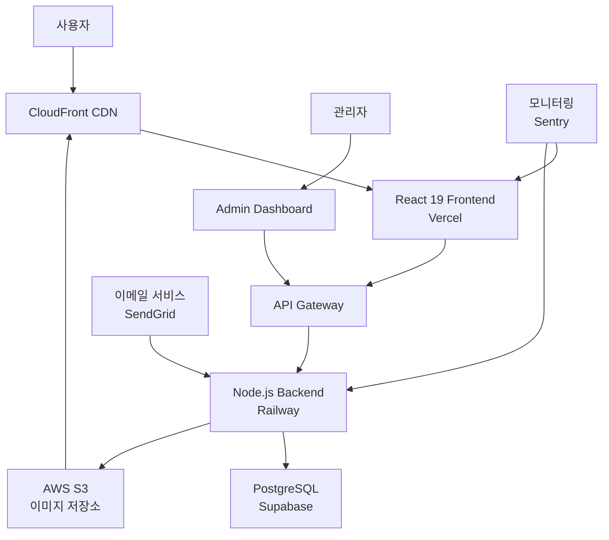
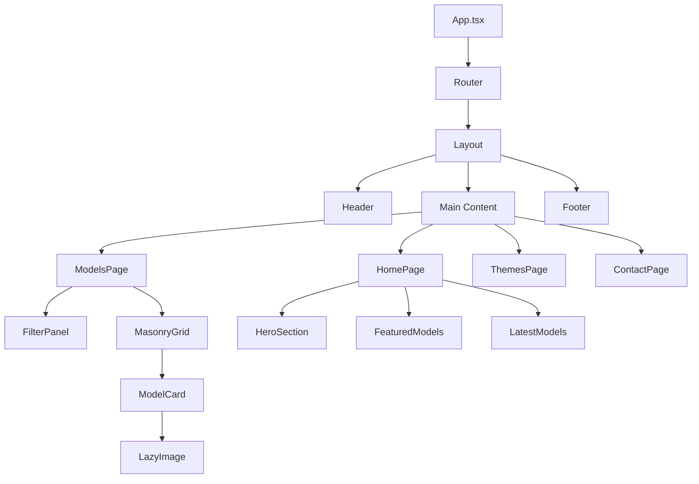

# AI 모델 갤러리 프로젝트 - 전체 구조 문서

## 🏗️ 프로젝트 아키텍처 개요

### 핵심 컨셉
**"BlurBlur.ai의 기능성 + Midjourney의 시각적 매력 + 개선된 사용자 경험"**

---

## 📁 프로젝트 디렉토리 구조

```
ai-model-gallery/
├── 📂 frontend/                    # React 19 클라이언트 애플리케이션
│   ├── 📂 public/
│   │   ├── icons/                  # 아이콘 에셋
│   │   └── images/                 # 정적 이미지
│   ├── 📂 src/
│   │   ├── 📂 components/          # 재사용 컴포넌트
│   │   │   ├── 📂 common/         # 공통 컴포넌트
│   │   │   │   ├── Header.tsx
│   │   │   │   ├── Footer.tsx
│   │   │   │   ├── Navigation.tsx
│   │   │   │   └── LoadingSpinner.tsx
│   │   │   ├── 📂 gallery/        # 갤러리 관련 컴포넌트
│   │   │   │   ├── MasonryGrid.tsx
│   │   │   │   ├── ModelCard.tsx
│   │   │   │   ├── ImageLazyLoader.tsx
│   │   │   │   └── FilterPanel.tsx
│   │   │   ├── 📂 forms/          # 폼 컴포넌트
│   │   │   │   ├── ContactForm.tsx
│   │   │   │   ├── SearchBar.tsx
│   │   │   │   └── FileUpload.tsx
│   │   │   └── 📂 modals/         # 모달 컴포넌트
│   │   │       ├── ModelDetail.tsx
│   │   │       └── ImageViewer.tsx
│   │   ├── 📂 pages/              # 페이지 컴포넌트
│   │   │   ├── HomePage.tsx
│   │   │   ├── ModelsPage.tsx
│   │   │   ├── ThemesPage.tsx
│   │   │   ├── ContactPage.tsx
│   │   │   └── ModelDetailPage.tsx
│   │   ├── 📂 hooks/              # Custom React 19 Hooks
│   │   │   ├── useInfiniteScroll.ts
│   │   │   ├── useMasonryLayout.ts
│   │   │   ├── useImageLazyLoad.ts
│   │   │   └── useDebounce.ts
│   │   ├── 📂 store/              # 상태 관리 (Zustand)
│   │   │   ├── modelStore.ts
│   │   │   ├── filterStore.ts
│   │   │   └── uiStore.ts
│   │   ├── 📂 services/           # API 통신
│   │   │   ├── api.ts
│   │   │   ├── modelService.ts
│   │   │   └── uploadService.ts
│   │   ├── 📂 utils/              # 유틸리티 함수
│   │   │   ├── imageUtils.ts
│   │   │   ├── layoutUtils.ts
│   │   │   └── constants.ts
│   │   ├── 📂 styles/             # 스타일 시트
│   │   │   ├── globals.css
│   │   │   ├── components.css
│   │   │   └── themes.css
│   │   └── 📂 types/              # TypeScript 5.9.2 타입 정의
│   │       ├── model.ts
│   │       ├── api.ts
│   │       └── common.ts
│   ├── 📄 package.json
│   ├── 📄 tsconfig.json
│   ├── 📄 tailwind.config.js
│   └── 📄 vite.config.ts
├── 📂 backend/                     # Node.js API 서버
│   ├── 📂 src/
│   │   ├── 📂 controllers/        # API 컨트롤러
│   │   │   ├── modelController.ts
│   │   │   ├── uploadController.ts
│   │   │   ├── themeController.ts
│   │   │   └── contactController.ts
│   │   ├── 📂 models/             # 데이터베이스 모델 (Prisma ORM v6)
│   │   │   └── schema.prisma
│   │   ├── 📂 routes/             # API 라우팅
│   │   │   ├── models.ts
│   │   │   ├── themes.ts
│   │   │   ├── upload.ts
│   │   │   └── contact.ts
│   │   ├── 📂 middleware/         # 미들웨어
│   │   │   ├── auth.ts
│   │   │   ├── upload.ts
│   │   │   ├── validation.ts
│   │   │   └── errorHandler.ts
│   │   ├── 📂 services/           # 비즈니스 로직
│   │   │   ├── modelService.ts
│   │   │   ├── imageService.ts
│   │   │   ├── emailService.ts
│   │   │   └── cacheService.ts
│   │   ├── 📂 utils/              # 백엔드 유틸리티
│   │   │   ├── imageProcessor.ts
│   │   │   ├── validation.ts
│   │   │   └── logger.ts
│   │   ├── 📂 config/             # 설정 파일
│   │   │   ├── database.ts
│   │   │   ├── aws.ts
│   │   │   └── environment.ts
│   │   └── 📄 app.ts              # Express 앱 진입점
│   ├── 📄 package.json
│   ├── 📄 tsconfig.json
│   └── 📄 .env.example
├── 📂 shared/                      # 공유 타입 및 유틸리티
│   ├── 📂 types/
│   │   ├── api.ts
│   │   ├── model.ts
│   │   └── common.ts
│   └── 📂 constants/
│       ├── categories.ts
│       └── validation.ts
├── 📂 docs/                        # 프로젝트 문서화
│   ├── 📄 blurblur-design-analysis.md
│   ├── 📄 midjourney-style-guide.md
│   ├── 📄 homepage-project-specification.md
│   ├── 📄 project-documentation-guide.md
│   ├── 📄 api-documentation.md
│   └── 📄 deployment-guide.md
├── 📂 infrastructure/              # 인프라스트럭처 코드
│   ├── 📂 terraform/              # Infrastructure as Code
│   ├── 📂 docker/                 # 컨테이너 설정
│   └── 📂 scripts/                # 배포 스크립트
└── 📄 README.md                    # 프로젝트 개요
```

---

## 🏛️ 시스템 아키텍처

### 전체 시스템 구조도


---

## 🎨 프론트엔드 아키텍처

### 컴포넌트 계층 구조


### 상태 관리 구조 (Zustand)
```typescript
// 전역 상태 구조
interface AppState {
  // 모델 관련 상태
  models: {
    items: Model[];
    filters: FilterState;
    pagination: PaginationState;
    loading: boolean;
    error: string | null;
  };
  
  // UI 상태
  ui: {
    theme: 'light' | 'dark';
    sidebarOpen: boolean;
    modalOpen: boolean;
    selectedModel: Model | null;
  };
  
  // 갤러리 레이아웃 상태
  gallery: {
    columnCount: number;
    itemHeight: Record<string, number>;
    viewportWidth: number;
    scrollPosition: number;
  };
}
```

### React 19 Query 데이터 페칭
```typescript
// API 쿼리 구조
const queries = {
  models: {
    list: (filters: FilterParams) => ['models', filters],
    detail: (id: string) => ['models', id],
    infinite: (filters: FilterParams) => ['models', 'infinite', filters]
  },
  themes: {
    list: () => ['themes'],
    models: (themeId: string) => ['themes', themeId, 'models']
  }
};
```

---

## 🔧 백엔드 아키텍처

### API 엔드포인트 구조
```yaml
API Routes:
  /api/v1/models:
    GET: 모델 목록 조회 (필터링, 페이징)
    POST: 새 모델 업로드
    
  /api/v1/models/:id:
    GET: 모델 상세 정보
    PUT: 모델 정보 수정
    DELETE: 모델 삭제
    
  /api/v1/themes:
    GET: 테마 목록
    POST: 새 테마 생성
    
  /api/v1/themes/:id/models:
    GET: 테마별 모델 목록
    
  /api/v1/upload:
    POST: 이미지 파일 업로드
    
  /api/v1/contact:
    POST: 문의 양식 제출
    
  /api/v1/search:
    GET: 모델 검색
```

### 데이터베이스 스키마 (Prisma ORM v6)
```prisma
model Model {
  id          String   @id @default(cuid())
  name        String
  nameEn      String?
  description String?
  category    Category
  industry    Industry
  imageUrl    String
  imageWidth  Int
  imageHeight Int
  fileSize    Int
  tags        String[]
  mood        String[]
  colorPalette String[]
  uploadedAt  DateTime @default(now())
  viewCount   Int      @default(0)
  likeCount   Int      @default(0)
  downloadCount Int    @default(0)
  isPublished Boolean  @default(false)
  
  themes      ThemeModel[]
  
  @@map("models")
}

model Theme {
  id          String   @id @default(cuid())
  name        String
  nameEn      String?
  description String?
  coverImage  String?
  isActive    Boolean  @default(true)
  createdAt   DateTime @default(now())
  
  models      ThemeModel[]
  
  @@map("themes")
}

model ThemeModel {
  themeId String
  modelId String
  order   Int?
  
  theme   Theme @relation(fields: [themeId], references: [id])
  model   Model @relation(fields: [modelId], references: [id])
  
  @@id([themeId, modelId])
  @@map("theme_models")
}

enum Category {
  ASIAN
  EUROPE
  AFRICA_AMERICA
  HISPANIC
  SPECIAL
}

enum Industry {
  FASHION
  COSMETICS
  LEISURE_SPORTS
  DIGITAL_ELECTRONICS
  FURNITURE_INTERIOR
  FOOD
  LIFESTYLE
  MUSIC_ARTS
}
```

---

## 🌐 인프라스트럭처 구조

### 배포 환경
```yaml
Production Environment:
  Frontend:
    Platform: Vercel
    Domain: Custom domain with Cloudflare
    CDN: Vercel Edge Network
    
  Backend:
    Platform: Railway
    Database: Supabase PostgreSQL
    File Storage: AWS S3 + CloudFront
    
  Monitoring:
    Application: Sentry
    Performance: Vercel Analytics
    Uptime: UptimeRobot
    
Development Environment:
  Frontend: Local Vite dev server
  Backend: Local Node.js server
  Database: Local PostgreSQL or Supabase dev
  File Storage: Local file system or AWS S3 dev bucket
```

### CI/CD 파이프라인
```yaml
GitHub Actions Workflow:
  Triggers:
    - Push to main branch
    - Pull request to main
    
  Frontend Pipeline:
    1. Checkout code
    2. Setup Node.js
    3. Install dependencies
    4. Run type checking
    5. Run linting
    6. Run tests
    7. Build application
    8. Deploy to Vercel
    
  Backend Pipeline:
    1. Checkout code
    2. Setup Node.js
    3. Install dependencies
    4. Run type checking
    5. Run linting
    6. Run tests
    7. Run Prisma ORM v6 migrations
    8. Deploy to Railway
```

---

## 🎯 핵심 기능 구현 전략

### 1. Masonry Layout 구현
```typescript
// 핵심 알고리즘
class MasonryLayout {
  private columns: number = 4;
  private gap: number = 16;
  private itemHeights: Map<string, number> = new Map();
  
  calculateLayout(items: Model[], containerWidth: number) {
    const columnWidth = (containerWidth - (this.columns - 1) * this.gap) / this.columns;
    const columnHeights = new Array(this.columns).fill(0);
    
    return items.map((item, index) => {
      const shortestColumn = columnHeights.indexOf(Math.min(...columnHeights));
      const x = shortestColumn * (columnWidth + this.gap);
      const y = columnHeights[shortestColumn];
      
      const aspectRatio = item.imageHeight / item.imageWidth;
      const height = columnWidth * aspectRatio;
      
      columnHeights[shortestColumn] += height + this.gap;
      
      return {
        item,
        x,
        y,
        width: columnWidth,
        height,
        column: shortestColumn
      };
    });
  }
}
```

### 2. 이미지 최적화 시스템
```typescript
// 이미지 최적화 파이프라인
interface ImageOptimization {
  // 업로드 시 처리
  processUpload: (file: File) => Promise<ProcessedImage[]>;
  
  // 반응형 이미지 생성
  generateResponsiveImages: (originalUrl: string) => ResponsiveImages;
  
  // 레이지 로딩
  lazyLoad: (element: HTMLImageElement) => void;
  
  // WebP 지원 감지
  supportsWebP: () => boolean;
}

// 사이즈별 이미지 생성
const RESPONSIVE_SIZES = [320, 640, 960, 1280, 1600];
const IMAGE_QUALITIES = { webp: 85, jpeg: 90 };
```

### 3. 성능 최적화 전략
```typescript
// 가상 스크롤링
interface VirtualScrollConfig {
  itemHeight: (index: number) => number;
  overscan: number;
  scrollThreshold: number;
}

// 무한 스크롤
const useInfiniteModels = (filters: FilterParams) => {
  return useInfiniteQuery({
    queryKey: ['models', 'infinite', filters],
    queryFn: ({ pageParam = 0 }) => fetchModels(filters, pageParam),
    getNextPageParam: (lastPage) => lastPage.nextCursor,
  });
};
```

---

## 📊 성능 모니터링 지표

### Core Web Vitals 목표
```yaml
Performance Targets:
  First Contentful Paint (FCP): < 1.5초
  Largest Contentful Paint (LCP): < 2.5초
  Cumulative Layout Shift (CLS): < 0.1
  First Input Delay (FID): < 100ms
  Time to Interactive (TTI): < 3.5초
  
Bundle Size Targets:
  Initial Bundle: < 500KB
  Total Bundle: < 2MB
  Individual Components: < 50KB
  
Image Optimization:
  Format: WebP with JPEG fallback
  Quality: 85% for WebP, 90% for JPEG
  Loading: Lazy loading with 100px threshold
  Caching: 1 year browser cache
```

### 모니터링 대시보드
```typescript
interface PerformanceMetrics {
  // 사용자 경험 지표
  userExperience: {
    pageLoadTime: number;
    imageLoadTime: number;
    scrollPerformance: number;
    interactionLatency: number;
  };
  
  // 기술적 지표
  technical: {
    bundleSize: number;
    memoryUsage: number;
    networkRequests: number;
    cacheHitRate: number;
  };
  
  // 비즈니스 지표
  business: {
    bounceRate: number;
    sessionDuration: number;
    pageViews: number;
    conversionRate: number;
  };
}
```

---

## 🔒 보안 및 품질 관리

### 보안 체크리스트
```yaml
Frontend Security:
  - XSS 방지: Content Security Policy
  - CSRF 보호: SameSite cookies
  - 데이터 검증: Zod schema validation
  - 민감정보 보호: 환경 변수 분리
  
Backend Security:
  - Rate Limiting: Express-rate-limit
  - Input Validation: Joi/Yup validation
  - SQL Injection 방지: Prisma ORM v6
  - File Upload 보안: MIME type 검증
  - CORS 설정: Origin 제한
  
Infrastructure Security:
  - HTTPS 강제: Cloudflare SSL
  - 데이터베이스 암호화: Supabase 기본 제공
  - API 키 관리: 환경 변수 + Secrets
  - 정기 보안 스캔: Snyk/Dependabot
```

### 코드 품질 관리
```yaml
Quality Assurance:
  Linting:
    - ESLint: 코드 스타일 및 오류 감지
    - Prettier: 코드 포맷팅
    - TypeScript 5.9.2: 타입 안정성
    
  Testing:
    - Unit Tests: Jest + React 19 Testing Library
    - Integration Tests: Cypress/Playwright
    - E2E Tests: Playwright
    - Performance Tests: Lighthouse CI
    
  Code Review:
    - Pull Request 필수
    - 최소 1명 승인 필요
    - 자동화된 테스트 통과 필수
    - 코드 커버리지 80% 이상
```

---

## 🎯 다음 단계 및 확장 계획

### 단기 목표 (1-3개월)
- ✅ 프로젝트 기본 구조 완성
- 📝 API 명세서 작성
- 🎨 디자인 시스템 구축
- 🔧 개발 환경 세팅

### 중기 목표 (3-6개월)
- 🚀 MVP 버전 런칭
- 📈 성능 최적화
- 🔍 SEO 최적화
- 📱 모바일 앱 개발 검토

### 장기 목표 (6-12개월)
- 🤖 AI 기반 추천 시스템
- 🌍 다국어 지원
- 🎬 동영상 콘텐츠 지원
- 💰 수익 모델 확장

이 전체 구조 문서는 프로젝트의 **모든 측면을 포괄하는 마스터플랜**으로, 개발팀이 **일관된 방향성**을 유지하며 **효율적으로 협업**할 수 있는 기반을 제공합니다.