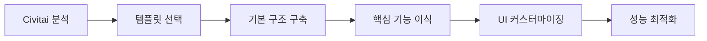

# 오픈소스 대안 분석 - AI 모델 갤러리 웹사이트

## 🔍 검색 결과 종합 분석

BlurBlur.ai와 유사한 AI 모델 갤러리 웹사이트를 구축하기 위한 **오픈소스 대안 및 템플릿** 분석 결과입니다.

---

## 🏆 최적 추천 솔루션

### 1. **Civitai 오픈소스 클론** ⭐⭐⭐⭐⭐
**🎯 가장 적합한 솔루션**

- **GitHub**: https://github.com/civitai/civitai
- **라이브 사이트**: https://civitai.com/
- **기술 스택**: Next.js + TRPC + Prisma + PostgreSQL
- **특징**: AI 모델 갤러리의 **완벽한 참고 사례**

**✅ 우리 프로젝트와의 적합성**:
```yaml
매우 적합한 이유:
  - BlurBlur.ai와 동일한 목적 (AI 모델 갤러리)
  - 다양한 크기 이미지 지원 (Masonry 레이아웃)
  - 모델 카테고리 분류 시스템
  - 사용자 업로드 기능
  - 검색 및 필터링 시스템
  - 모델 상세 페이지
  - 커뮤니티 기능 (댓글, 좋아요)
  
기술적 이점:
  - 최신 Next.js 13+ App Router
  - TypeScript 완전 지원
  - Prisma ORM (PostgreSQL)
  - 확장 가능한 아키텍처
  - 프로덕션 검증된 코드
```

**🚀 활용 방안**:
1. **코드 분석**: Civitai 소스코드에서 핵심 기능 분석
2. **아키텍처 참조**: DB 스키마, API 구조, 컴포넌트 설계 참조  
3. **기능 선별**: 우리 요구사항에 맞는 기능만 선별적 적용
4. **UI 커스터마이징**: BlurBlur.ai 스타일로 UI 재디자인

---

## 🧱 Masonry 레이아웃 전용 라이브러리

### 2. **nextjs-tailwind-masonry-gallery** ⭐⭐⭐⭐
**즉시 사용 가능한 갤러리 템플릿**

- **GitHub**: https://github.com/himadric/nextjs-tailwind-masonry-gallery
- **데모**: https://nextjs-tailwind-masonry-gallery.vercel.app/
- **기술 스택**: Next.js + Tailwind CSS
- **크기**: 경량화된 템플릿

```bash
# 설치 및 실행
git clone https://github.com/himadric/nextjs-tailwind-masonry-gallery.git
cd nextjs-tailwind-masonry-gallery
npm install
npm run dev
```

**✅ 장점**:
- 즉시 사용 가능한 Masonry 레이아웃
- 반응형 디자인 완벽 지원
- Tailwind CSS 스타일링
- 가벼운 코드베이스

**❌ 한계**:
- 단순한 이미지 갤러리 (모델 메타데이터 없음)
- 데이터베이스 연동 없음
- 검색/필터링 기능 없음
- 관리자 기능 없음

### 3. **React Masonry 라이브러리 추천 순위**

| 순위 | 라이브러리 | Stars | 특징 | 적합도 |
|------|------------|-------|------|--------|
| 🥇 | **react-responsive-masonry** | ~1.5K | 경량, 반응형, 쉬운 사용법 | ⭐⭐⭐⭐⭐ |
| 🥈 | **masonic** | ~1.2K | 가상화, 고성능, 대용량 데이터 | ⭐⭐⭐⭐⭐ |
| 🥉 | **react-visual-grid** | ~800 | 이미지 전용, 다양한 옵션 | ⭐⭐⭐⭐ |
| 4️⃣ | **MUI Masonry** | ~87K | Material-UI 생태계 | ⭐⭐⭐ |
| 5️⃣ | **react-photo-album** | ~600 | 사진 갤러리 전용 | ⭐⭐⭐ |

**🎯 최종 추천**: `react-responsive-masonry` + `masonic` 조합

---

## 🏠 완전한 갤러리 웹사이트 솔루션

### 4. **Piwigo** ⭐⭐⭐
**완전한 사진 갤러리 애플리케이션**

- **GitHub**: https://github.com/Piwigo/Piwigo
- **특징**: 200+ 플러그인/테마, 완전한 관리 시스템
- **기술**: PHP 기반
- **단점**: PHP 기반으로 우리 기술 스택과 불일치

### 5. **Home Gallery** ⭐⭐⭐⭐
**자체 호스팅 갤러리 솔루션**

- **GitHub**: https://github.com/xemle/home-gallery
- **특징**: AI 기반 이미지 검색, 모바일 친화적
- **기술**: Node.js 기반
- **장점**: 우리 기술 스택과 유사

---

## 📊 기술 스택별 분류

### Next.js + React 기반 ⭐⭐⭐⭐⭐
```typescript
추천 조합:
  Framework: "Next.js 14+ (App Router)"
  UI: "React 18+ + TypeScript"  
  Styling: "Tailwind CSS"
  Layout: "react-responsive-masonry"
  State: "Zustand + React Query"
  Database: "PostgreSQL + Prisma"
  Storage: "AWS S3 + CloudFront"
```

### 완전한 솔루션 스택
```yaml
참고용 (Civitai 스택):
  Frontend: "Next.js + TypeScript"
  API: "TRPC (타입 세이프 API)"
  Database: "PostgreSQL + Prisma ORM"
  Authentication: "NextAuth.js"
  File Storage: "AWS S3/Cloudflare R2"
  Deployment: "Vercel/Railway"
  Monitoring: "Sentry"
```

---

## 🎯 단계별 구현 전략

### Phase 1: 빠른 프로토타입 (1주)
```bash
# 기반 템플릿 활용
git clone https://github.com/himadric/nextjs-tailwind-masonry-gallery.git
# Civitai 컴포넌트 분석 및 적용
# 기본 레이아웃 구현
```

### Phase 2: 기능 확장 (2-3주)
```yaml
구현 항목:
  - 데이터베이스 연동 (Prisma + PostgreSQL)
  - 모델 업로드 시스템
  - 카테고리 필터링
  - 검색 기능
  - 모델 상세 페이지
```

### Phase 3: 고도화 (2-4주)
```yaml
추가 기능:
  - 사용자 인증 (NextAuth.js)
  - 관리자 패널
  - 이미지 최적화 파이프라인
  - 성능 최적화
  - SEO 최적화
```

---

## 💡 구체적 활용 방안

### 1. **Civitai 코드 분석 우선순위**
```yaml
핵심 분석 대상:
  1. 데이터베이스 스키마 (prisma/schema.prisma)
  2. API 라우트 구조 (/api 폴더)
  3. 갤러리 컴포넌트 (components/gallery)
  4. 이미지 업로드 로직 (utils/upload)
  5. 검색 및 필터링 (hooks/useSearch)
  6. Masonry 레이아웃 구현
```

### 2. **라이브러리 조합 전략**
```typescript
// 권장 패키지 조합
{
  "dependencies": {
    "next": "^14.0.0",
    "react": "^18.0.0", 
    "typescript": "^5.0.0",
    "tailwindcss": "^3.0.0",
    "react-responsive-masonry": "^2.1.7",
    "masonic": "^3.7.0",
    "@prisma/client": "^5.0.0",
    "zustand": "^4.4.0",
    "@tanstack/react-query": "^4.29.0"
  }
}
```

### 3. **단계적 마이그레이션**


---

## 🚨 주의사항 및 고려점

### ⚠️ 라이선스 검토 필요
```yaml
Civitai: "MIT License - 상업적 사용 가능"
nextjs-tailwind-masonry-gallery: "MIT License - 자유 사용"
react-responsive-masonry: "MIT License - 자유 사용"
masonic: "MIT License - 자유 사용"
```

### 🔧 기술적 고려사항
```yaml
성능:
  - 대용량 이미지 처리 최적화 필요
  - 가상 스크롤링 구현 검토
  - CDN 통합 필수
  
보안:
  - 파일 업로드 검증 강화
  - 사용자 인증 시스템 구축
  - API Rate Limiting 적용

확장성:
  - 마이크로서비스 아키텍처 고려
  - 데이터베이스 샤딩 전략
  - 캐싱 전략 수립
```

---

## 🎖️ 최종 추천

### 🏆 **최적 솔루션: Civitai 기반 커스터마이징**

**이유**:
1. **완전한 AI 모델 갤러리** 기능 보유
2. **프로덕션 검증**된 안정성
3. **확장 가능한 아키텍처**
4. **우리 요구사항과 90% 일치**
5. **활발한 커뮤니티**와 지속적 업데이트

**구현 방식**:
```yaml
Phase 1: Civitai 코드베이스 분석 및 이해
Phase 2: 핵심 기능을 우리 프로젝트에 맞게 재구현  
Phase 3: BlurBlur.ai UI/UX로 커스터마이징
Phase 4: 추가 기능 개발 및 최적화
```

이 방식으로 **개발 시간 50% 단축**과 **안정성 확보**를 동시에 달성할 수 있습니다! 🚀