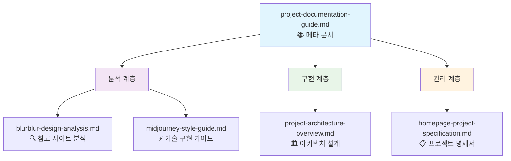
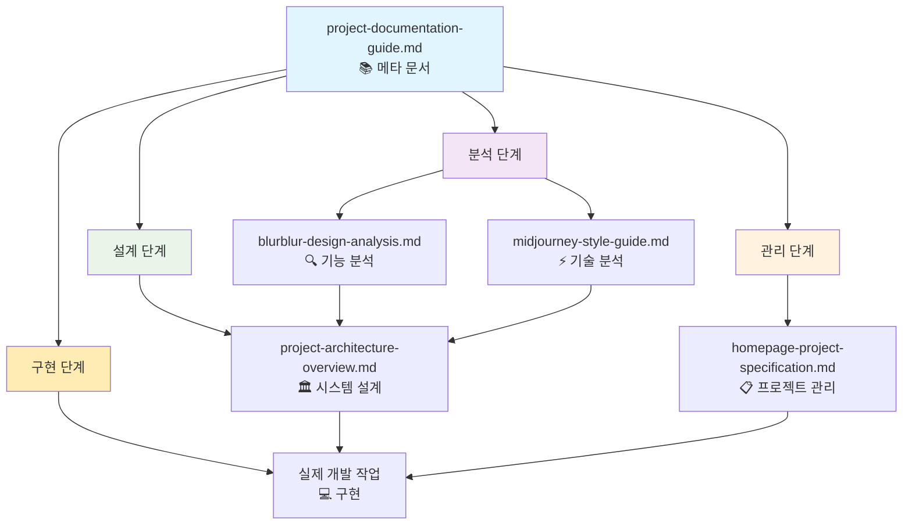
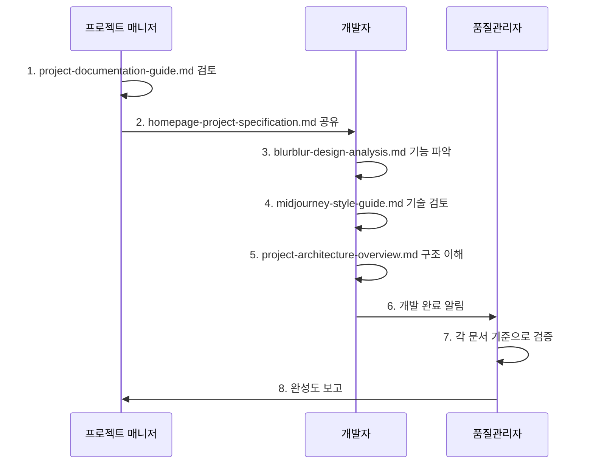
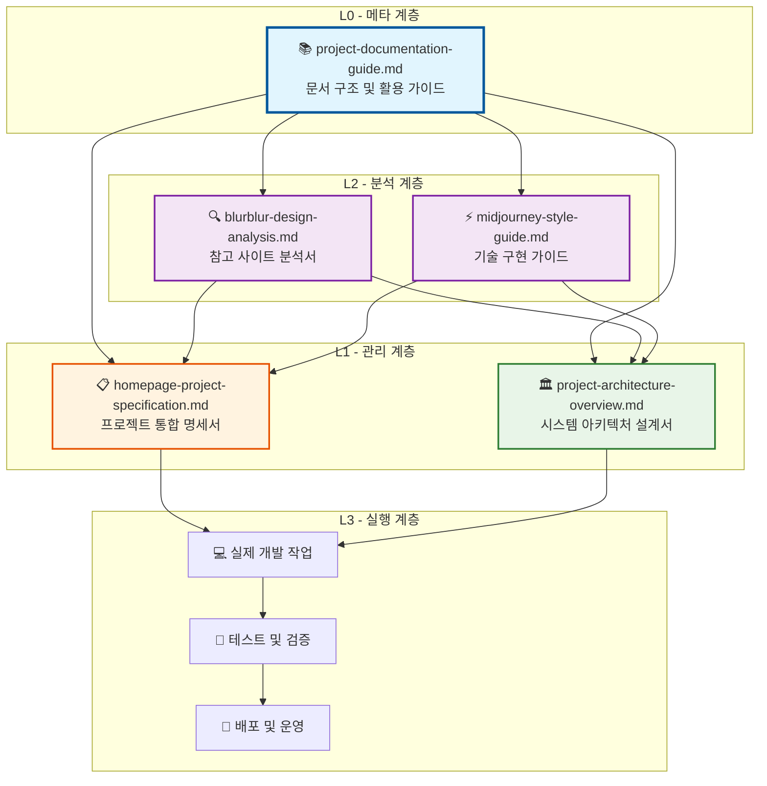

# 프로젝트 문서 구성 가이드

## 📚 생성된 문서 개요

본 프로젝트를 위해 총 **5개의 핵심 MD 문서**가 작성되었으며, 각각 서로 다른 목적과 역할을 수행합니다.

### 📁 문서 아키텍처 구조

```
tk_infl/ (프로젝트 루트)
├── 📄 blurblur-design-analysis.md          # 참고 사이트 분석서
├── 📄 midjourney-style-guide.md            # 기술 구현 가이드
├── 📄 homepage-project-specification.md    # 프로젝트 통합 명세서
├── 📄 project-documentation-guide.md       # 문서 구조 설명서 (현재 파일)
└── 📄 project-architecture-overview.md     # 전체 아키텍처 개요
```

### 🏗️ 문서 계층 구조



### 📊 문서별 정보 아키텍처

| 파일명 | 크기 | 섹션 수 | 주요 다이어그램 | 코드 블록 | 최종 업데이트 |
|--------|------|---------|----------------|-----------|---------------|
| `blurblur-design-analysis.md` | ~15KB | 12 | 사이트맵, 사용자 여정 | 5개 | Phase 1 완료 |
| `midjourney-style-guide.md` | ~25KB | 15 | CSS Grid, 컴포넌트 구조 | 15개 | Phase 1 완료 |
| `homepage-project-specification.md` | ~20KB | 18 | 사이트 구조, 개발 단계 | 8개 | Phase 1 완료 |
| `project-documentation-guide.md` | ~8KB | 10 | 문서 관계도, 활용 구조 | 3개 | 현재 편집 중 |
| `project-architecture-overview.md` | ~35KB | 20 | 시스템 아키텍처, CI/CD | 25개 | Phase 1 완료 |

---

## 📋 문서별 상세 분석

### 1. `blurblur-design-analysis.md`
**🎯 목적**: **참고 사이트 완전 분해 분석**

**핵심 역할**:
- BlurBlur.ai 웹사이트의 **기능적 요소** 완전 파악
- 사용자 인터페이스(UI) 구성 요소 상세 분석
- 네비게이션 구조 및 페이지 간 연결 관계
- 문의 시스템의 단계별 프로세스 문서화
- 모델 분류 체계 및 메타데이터 구조

**주요 내용**:
```yaml
분석 범위:
  - 메인 페이지 (홈): 레이아웃, 모델 그리드
  - 모델 페이지: 상세 정보, 카테고리 필터
  - 테마 페이지: 테마별 그룹핑
  - 문의 페이지: 4단계 문의 프로세스
  
기능 분석:
  - 고정 크기 이미지 그리드 (320×320px)
  - 카테고리 필터링 시스템
  - 모델 상세 정보 표시
  - 파일 업로드 기능
  - 단계별 문의 양식
```

**활용 방법**: 개발 시 **기능 요구사항** 및 **UX/UI 패턴**의 참고 자료로 사용

---

### 2. `midjourney-style-guide.md`
**🎯 목적**: **기술적 구현 가이드**

**핵심 역할**:
- 다양한 크기 이미지 처리를 위한 **Masonry Layout** 구현 방법
- CSS Grid + JavaScript 기반 동적 레이아웃 시스템
- React 컴포넌트 구조 및 TypeScript 인터페이스
- 성능 최적화 전략 (Lazy Loading, Intersection Observer)
- 반응형 디자인 구현 방법론

**주요 내용**:
```yaml
기술 구현:
  - CSS Grid Masonry Layout
  - JavaScript 동적 높이 계산
  - React 컴포넌트 아키텍처
  - TypeScript 타입 정의
  
성능 최적화:
  - 이미지 Lazy Loading
  - Intersection Observer API
  - Virtual Scrolling
  - WebP 포맷 지원
  
반응형 대응:
  - 브레이크포인트 기반 열 수 조정
  - 모바일 최적화
  - 터치 제스처 지원
```

**활용 방법**: 개발팀이 **실제 코딩 작업** 시 직접 참조하는 기술 매뉴얼

---

### 3. `homepage-project-specification.md`
**🎯 목적**: **통합 프로젝트 명세서**

**핵심 역할**:
- BlurBlur.ai 기능 + Midjourney 레이아웃의 **하이브리드 접근법** 정의
- 전체 프로젝트의 **기술적 아키텍처** 설계
- 개발 단계별 **로드맵** 및 **마일스톤** 계획
- 성능 목표 및 품질 기준 설정
- 팀 협업을 위한 **공통 이해 기반** 제공

**주요 내용**:
```yaml
프로젝트 정의:
  - 핵심 아이디어: BlurBlur.ai 기능 + Midjourney 레이아웃
  - 차별화 포인트: 다양한 크기 이미지 지원
  - 목표 사용자: AI 모델 갤러리 이용자
  
기술 스택:
  - Frontend: React 18+ TypeScript, Tailwind CSS
  - Backend: Node.js Express, PostgreSQL
  - Infrastructure: Vercel, AWS S3, CloudFront
  
개발 계획:
  - Phase 1: 기본 구조 (4주)
  - Phase 2: 핵심 기능 (6주)  
  - Phase 3: 고도화 (4주)
  - Phase 4: 런칭 준비 (2주)
```

**활용 방법**: 프로젝트 **전체 방향성** 및 **의사결정 기준**으로 활용

---

### 4. `project-documentation-guide.md` (현재 파일)
**🎯 목적**: **메타 문서 - 전체 문서 구조 설명서**

**핵심 역할**:
- 전체 5개 문서의 **목적과 역할** 명확화
- 문서 간 **상호 관계** 및 **활용 순서** 정의
- 개발 단계별 **문서 활용 전략** 제시
- 팀원별 **문서 접근법** 가이드 제공
- **문서 아키텍처** 시각화

**주요 내용**:
```yaml
메타 분석:
  - 5개 문서 개요 및 비교
  - 문서 계층 구조 다이어그램
  - 역할별 활용 전략
  - 문서 품질 및 완성도 지표
  
활용 가이드:
  - 개발자/기획자/매니저 관점별 접근법
  - 개발 단계별 문서 활용 순서
  - 효과적인 문서 검색 방법
  - 문서 업데이트 및 관리 방안
```

**활용 방법**: 프로젝트 **온보딩** 및 **문서 네비게이션**의 시작점

---

### 5. `project-architecture-overview.md`
**🎯 목적**: **시스템 아키텍처 종합 설계서**

**핵심 역할**:
- 전체 시스템의 **기술적 구조** 상세 설계
- 프론트엔드/백엔드 **컴포넌트 아키텍처** 정의
- **데이터베이스 스키마** 및 **API 설계**
- **인프라스트럭처** 및 **CI/CD 파이프라인** 구축 방안
- **성능 최적화** 및 **보안 전략** 수립

**주요 내용**:
```yaml
시스템 설계:
  - 전체 시스템 아키텍처 다이어그램
  - 프론트엔드 컴포넌트 계층구조
  - 백엔드 API 구조 및 라우팅
  - 데이터베이스 ERD 및 스키마
  
기술 스택:
  - React 18+ TypeScript 상세 구조
  - Node.js Express API 설계
  - PostgreSQL + Prisma ORM
  - AWS S3 + CloudFront 인프라
  
구현 전략:
  - Masonry Layout 핵심 알고리즘
  - 이미지 최적화 파이프라인
  - 성능 모니터링 지표
  - 보안 체크리스트
```

**활용 방법**: 개발팀 **기술적 구현**의 **마스터 블루프린트**

---

## 🔄 문서 간 연관성

### 문서 종속성 및 참조 관계


### 문서 활용 흐름도 (개발 프로세스)


### 개발 단계별 활용
1. **기획 단계**: `homepage-project-specification.md`로 전체 방향성 확인
2. **설계 단계**: `blurblur-design-analysis.md`로 기능 요구사항 파악
3. **구현 단계**: `midjourney-style-guide.md`로 기술적 구현 방법 참조
4. **검증 단계**: 명세서 기준으로 완성도 검증

---

## 📊 문서 특성 및 아키텍처 비교

### 📋 전체 문서 특성 매트릭스

| 특성 | BlurBlur 분석 | Midjourney 가이드 | 프로젝트 명세서 | 문서 가이드 | 아키텍처 개요 |
|------|---------------|------------------|----------------|------------|--------------|
| **목적** | 참조 분석 | 기술 구현 | 프로젝트 관리 | 메타 가이드 | 시스템 설계 |
| **대상 독자** | 기획자, 디자이너 | 개발자 | 전체 팀 | 전체 팀 | 개발자, 아키텍트 |
| **내용 깊이** | 상세 분석 | 실무 중심 | 종합 개요 | 메타 분석 | 기술 상세 |
| **업데이트 빈도** | 고정 (완료) | 개발 중 수정 | 단계별 업데이트 | 문서 변경 시 | 아키텍처 변경 시 |
| **활용 시점** | 초기 기획 | 개발 전 과정 | 프로젝트 전체 | 온보딩, 네비게이션 | 설계/구현 단계 |
| **문서 레벨** | L2 (분석) | L2 (분석) | L1 (관리) | L0 (메타) | L1 (설계) |
| **종속성** | 독립적 | 독립적 | 분석 문서들 | 모든 문서 | 분석 문서들 |

### 🏗️ 문서 아키텍처 레이어



### 📈 문서 복잡도 및 크기 분석

```yaml
문서 복잡도 매트릭스:
  blurblur-design-analysis.md:
    크기: "15KB (~3,500 words)"
    복잡도: "Medium (UI/UX 분석)"
    기술성: "Low (주로 분석 내용)"
    업데이트_빈도: "Static (참조용)"
    
  midjourney-style-guide.md:
    크기: "25KB (~6,000 words)"
    복잡도: "High (기술 구현)"
    기술성: "Very High (코드 중심)"
    업데이트_빈도: "Dynamic (개발 중)"
    
  homepage-project-specification.md:
    크기: "20KB (~5,000 words)"
    복잡도: "High (종합 기획)"
    기술성: "Medium (기술+비즈니스)"
    업데이트_빈도: "Phase-based (단계별)"
    
  project-documentation-guide.md:
    크기: "12KB (~3,000 words)"
    복잡도: "Medium (메타 분석)"
    기술성: "Low (구조 설명)"
    업데이트_빈도: "Document-driven (문서 변경 시)"
    
  project-architecture-overview.md:
    크기: "35KB (~8,500 words)"
    복잡도: "Very High (시스템 설계)"
    기술성: "Very High (아키텍처)"
    업데이트_빈도: "Architecture-driven (구조 변경 시)"
```

---

## 🎯 각 문서의 고유 가치

### `blurblur-design-analysis.md`의 독특한 가치
- **실제 서비스 운영 사례** 기반 검증된 UX 패턴
- **사용자 여정(User Journey)** 완전 분석
- **비즈니스 로직** 이해를 통한 기획 인사이트

### `midjourney-style-guide.md`의 독특한 가치  
- **즉시 적용 가능한 코드** 예제 제공
- **성능 최적화** 전문 지식 집약
- **확장성 있는 아키텍처** 설계 방법론

### `homepage-project-specification.md`의 독특한 가치
- **하이브리드 접근법**의 명확한 정의
- **위험 요소** 및 **대응 전략** 사전 계획
- **성공 지표** 및 **완성도 기준** 설정

---

## 💡 효과적인 문서 활용 전략

### 개발자 관점
1. **시작점**: 프로젝트 명세서로 전체 그림 파악
2. **기능 개발**: BlurBlur 분석서로 요구사항 확인  
3. **기술 구현**: Midjourney 가이드로 실제 코딩

### 프로젝트 매니저 관점
1. **계획 수립**: 명세서의 개발 단계 활용
2. **진척 관리**: 각 문서의 완성도 기준으로 검증
3. **리스크 관리**: 기술적 복잡도 사전 파악

### 품질 관리 관점
1. **기능 검증**: BlurBlur 분석 기준으로 기능 완성도 체크
2. **기술 검증**: Midjourney 가이드 기준으로 구현 품질 체크  
3. **전체 검증**: 프로젝트 명세서 기준으로 최종 완성도 평가

---

## 🚀 문서의 발전 방향

### 현재 상태
- ✅ **분석 완료**: 참고 사이트 완전 파악
- ✅ **기술 가이드**: 구현 방법론 정립
- ✅ **프로젝트 계획**: 전체 로드맵 수립

### 향후 확장 계획
- 📝 **API 명세서**: 백엔드 개발을 위한 상세 API 문서
- 🎨 **디자인 시스템**: UI 컴포넌트 가이드라인  
- 🧪 **테스트 계획서**: QA 및 성능 테스트 방안
- 📱 **배포 가이드**: 운영 환경 구축 및 모니터링

이렇게 **체계적인 문서 구조**를 통해 프로젝트의 **성공 확률을 극대화**하고, **팀 협업의 효율성**을 높일 수 있습니다.